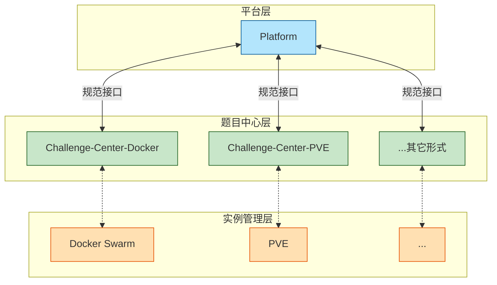

# Cranberry 架构设计

## 基本结构

逻辑上说，**Cranberry 由三个子系统构成：平台（Platform）、题目中心（Challenge Center）、实例管理器（Instance Manager）**。在实践上，实例管理器一般是现成的（例如 Docker Swarm）。我们只规定平台与题目中心之间的通讯接口，不限制题目中心与实例管理器的通讯方式。每种靶机形式都会有自己的题目中心，例如 docker 题目中心、PVE 题目中心。**一个平台可以连接多个题目中心，一个题目中心也可以给多个平台供题。**

