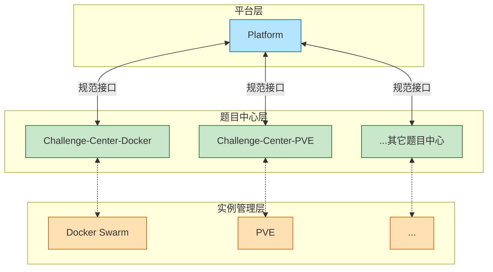

# Cranberry 架构概览

## 基本结构

逻辑上说，**Cranberry 由三层子系统构成：平台、题目中心、实例管理器**。在实践上，实例管理器一般是现成的（例如 Docker Swarm）。我们只规定平台与题目中心之间的通讯接口，不限制题目中心与实例管理器的通讯方式。每种靶机形式都会有自己的题目中心，例如 docker 题目中心、PVE 题目中心。**一个平台可以连接多个题目中心，一个题目中心也可以给多个平台供题。**

我们现在按自顶向下的顺序，介绍这三个层。

### 平台

平台（Platform）是与参赛者交互的唯一界面。它采取前后端分离实现，技术选型表如下：

<table>
  <thead>
    <tr>
      <th>组件</th>
      <th>运行环境</th>
      <th>选型</th>
      <th>版本</th>
    </tr>
  </thead>
  <tbody>
    <tr>
      <td rowspan="4">后端</td>
      <td rowspan="4">Kotlin 2.2 / GraalVM JDK 24</td>
      <td>Spring Boot</td>
      <td>3.5.6</td>
    </tr>
    <tr>
      <td>Spring Web MVC</td>
      <td rowspan="3">跟随 Spring Boot</td>
    </tr>
    <tr>
      <td>Spring Data JDBC</td>
    </tr>
    <tr>
      <td>Spring Security</td>
    </tr>
    <tr>
      <td>关系型数据库</td>
      <td>-</td>
      <td>PostgreSQL</td>
      <td>18</td>
    </tr>
    <tr>
      <td>对象存储</td>
      <td>-</td>
      <td>MinIO</td>
      <td>latest</td>
    </tr>
    <tr>
      <td>反向代理</td>
      <td>-</td>
      <td>Nginx</td>
      <td>latest</td>
    </tr>
  </tbody>
</table>

几个关键点：
- 用户信息仅在平台中存储。后方的题目中心、实例管理器都不知道用户的存在。
- 平台完全不管理题目内容。逻辑上，它只是担任用户的 agent，向题目中心请求题目内容、申请靶机、提交 flag 并获取 flag 验证结果。不过在实践上，平台会缓存很多东西（如题目描述、附件、可在平台侧执行的 checker 等）。
- 平台负责管理赛事。赛事业务指的是：赛事数据管理（例如比赛开始时间和结束时间）；题目的编排（包括顺序和标签）；分数的维护；排行榜的生成。

### 题目中心

题目中心有两个职责：管理题目，以及维护靶机。

【TODO】