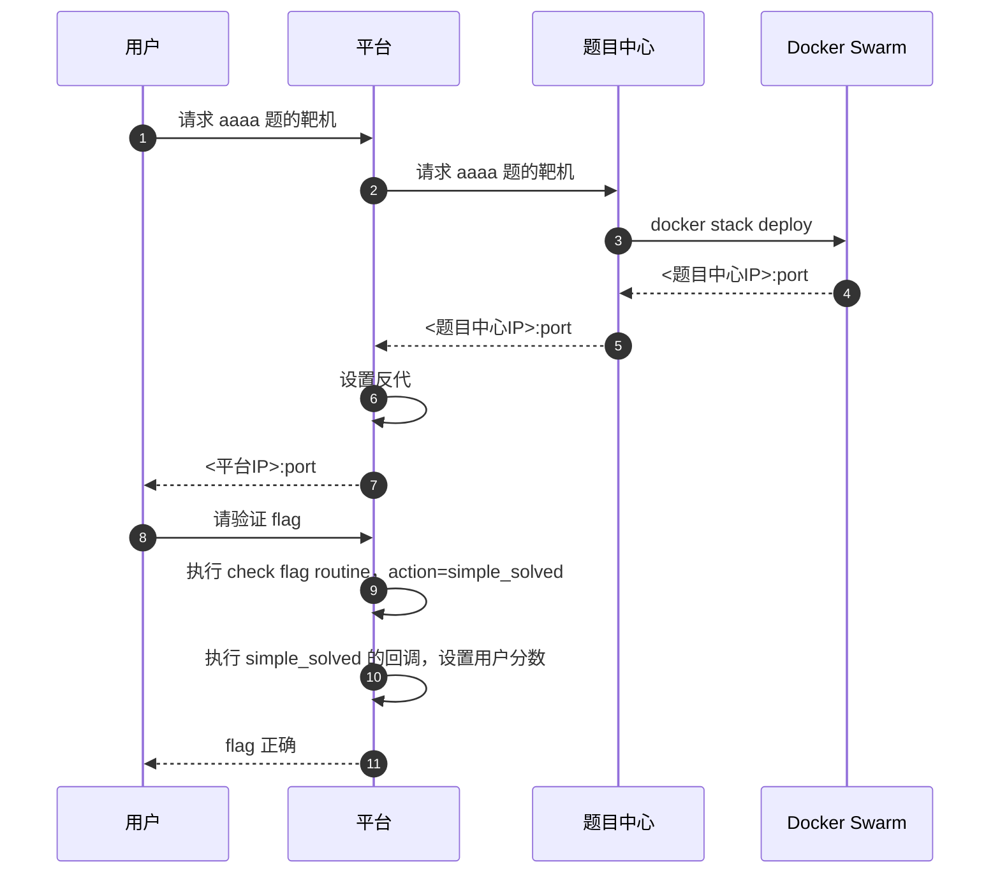
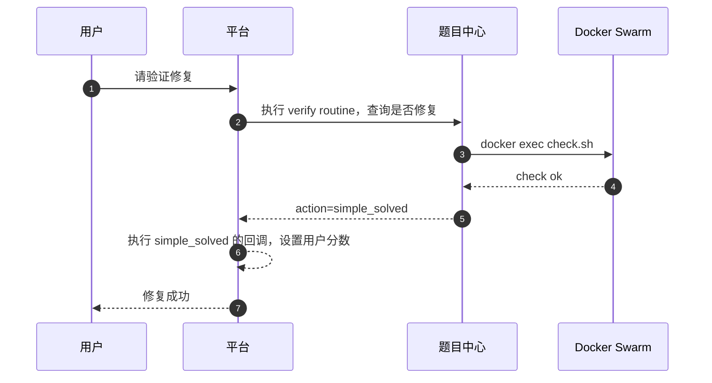
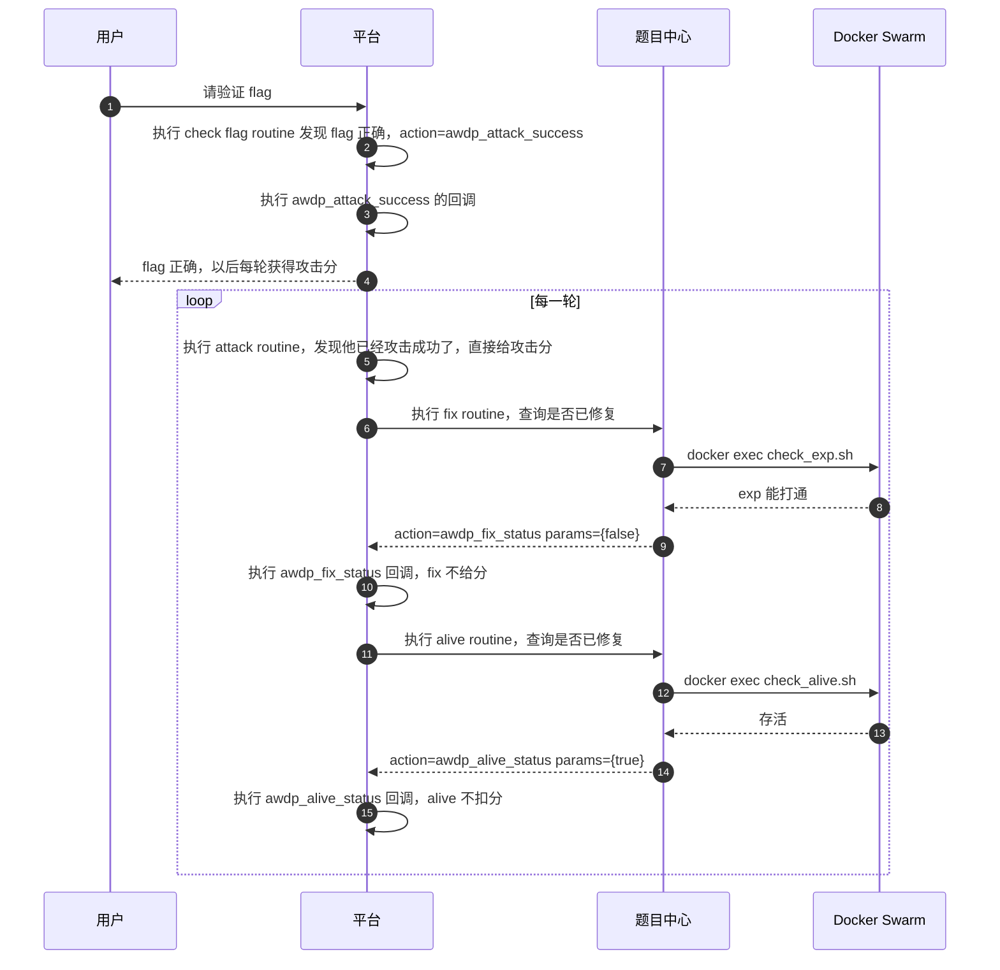
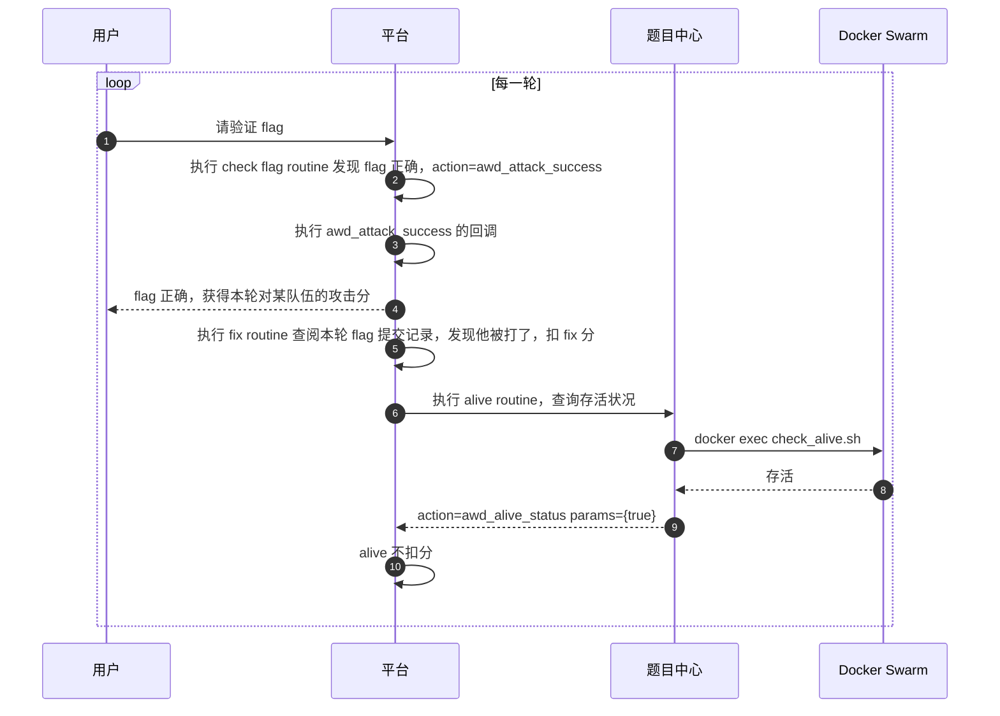
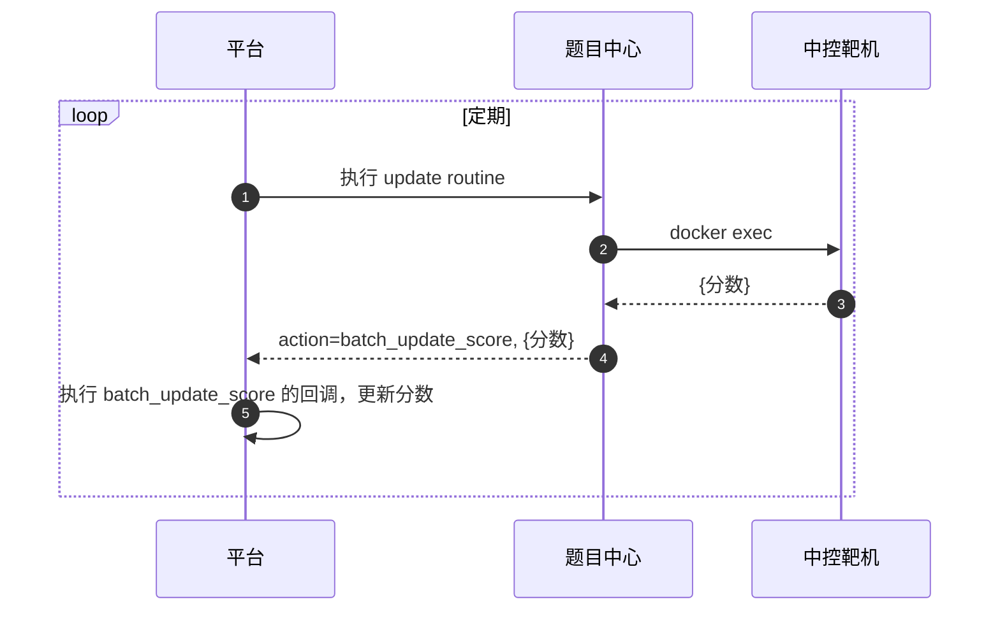

# Cranberry 各模块设计沉思录

> 「……是的，动态靶机 CTF 平台本质是个云平台。」  
> -- Merrg1n, 2025/10/8


本文不是一篇手册性的文章，而是一篇解释性的文章。笔者希望以此一文，解释几个问题：为什么如此设计平台与题目中心的分工；为什么选择了 Docker Swarm 和 PVE；以及为什么放弃了 Flask 而选择 Spring Web MVC。


### 从需求推演解决方案

在[《引言：我们需要怎样的平台》](/docs/blog/我们需要怎样的平台/)文中，我们提出了几个雄心勃勃的目标：在一场赛事中，同时包含解题、patch、AWDP、AWD、KoH 题目；还要 checker 既能在平台侧运行，又能在靶机侧运行；还要支持前三血和动态分。

抽丝剥茧，我们先看选手最关心的问题——判分。这些题目类型中，有些是只有通过/不通过两种情况（传统 CTF 题和 patch 题），有些是可以给部分分数（例如引言中提到的猜数博弈题目），有些是周期性得分（AWD 和 AWDP 每轮都会有分数变化），有些是在静态共享靶机场景下频繁更新每个人的得分（KoH）。得分方式当然是题目的一部分，所以应当由题目中心决定。然而，题目中心不该决定“这题在赛事中值多少分”——那是赛事管理的工作。于是我们立即可以得到一个模型：

- 平台上有若干个“计分器”（score counter），它的基本属性是从题目信息那里继承来的。额外地，每个计分器有分值 `point` 属性，表示它当前在赛事中的参考分值。选手在赛事中的得分，即为他在所有计分器上的得分之总和。
- 由判分脚本决定选手可以在计分器上得到多少比例的分数（例如选手能得 60% 的分），平台会将这个比例乘以 `point`，作为选手分数。
- 判分脚本可以要求平台“把某选手在某题的进度设为 solved”“给某选手在某计分器上的分值改为 k”“给某选手某计分器加 k 分”“按我这张清单更新所有人的分数”。

> [!NOTE]  
> 请注意，判分脚本可以运行在平台侧或靶机侧。传统题目是运行在平台侧，与 Blueberry 一致。但 patch 题目需要在靶机内运行检验程序，反馈“选手是否成功修复”；KoH 题目需要在中控靶机上运行计分脚本，获取所有人的最新分数。

有了计分器的概念，我们马上就能优雅地实现以下需求。

1. 普通 CTF / patch 题——让做出来的选手获得本计分器的分数。可以应用前三血和动态分规则，前者即是把选手的得分比例换成 105% 等值，后者即是降低此计分器的 `point`。
2. 可得部分分的题目，给一定比例的分数。计分器的 `point` 保持不变。
3. 对于 AWD / AWDP，固定 `point = 1`，每一轮给每个选手计算分数变化（例如，attack 计分器加 5000% 分，即为 +50 分；fix 计分器扣 3000% 分，即为 -30 分）。
4. 对于 KoH，一次性更新所有选手的分数。固定 `point = 1`，由靶机随便给选手赋分。

由于我们的判分脚本与原始的 checker（检查 flag 是否正确）有了很大区别，能做漏洞验证、统计所有人分数等任务，我们有必要换个词来称呼它，笔者选择的是 routine。

> [!NOTE]  
> 形式化地说，一个 routine 就是一个 Python 函数，完成任务后返回一个 action 要求平台执行：
> ```python
> def routine(user_id, routine_id, user_message):
>     return action, params, routine_message   
>     # 合法的 action 包括：nop, simple_solved, set_score, add_score, batch_update_score...
>     # 下面是一些示例：
>     # action: nop                 params: null
>     # action: simple_solved       params: {uid, score_counter_id}
>     # action: set_score           params: {uid, score_counter_id, score}
>     # action: add_score           params: {uid, score_counter_id, score}
>     # action: batch_update_score  params: {score_counter_id, {uid: score, ...}}
> ```
> 它要么在平台上执行（例如验证动态 flag 是否正确），要么在题目中心上执行（例如通过 Docker SDK 连入靶机运行命令并分析结果）。注意 routine 并不强制与 score counter 耦合，只是通常情况下 `score_counter_id` 会被硬编码进 routine 代码中。  
> 其实，一些并非判分的功能也可以通过 routine 实现。例如，当选手按下按钮后，routine 连接到容器并执行 `/etc/init.d/mysqld restart`，然后返回 `nop`，不更新分数。

那么，routine 什么时候被触发？对于传统题目，是选手提交 flag 的那一刻；对于 patch 题目，是选手按下检验按钮的那一刻；对于 AWD / AWDP 题目，每若干分钟自动触发一次。所以，routine 也是有类型的：`check_flag` 类型的 routine 要在前端给选手提供 flag 输入框，`verify` 类型的 routine 要给选手提供按钮，`other` 类型的 routine 直接隐身，只有平台能调用它们。

细心的读者可能会注意到，patch 题目的 routine 是在靶机侧运行的，根本不知道场上有多少人解出，该如何实现前三血呢？其实 routine 自己不用管有多少人解出，它只需要返回 `action=simple_solved`，平台在执行 `simple_solved` 的回调时，自然会把得分比例修正成考虑了前三血后的样子。

### 几个例子

下面，笔者将会举出一些案例，来证明“routine + score counter”可以完成所有需求。

**传统解题（即 Blueberry 模式）**。每项子任务体现为一个 `check_flag` 类型的 routine，各自对应一个 score conter。由于平台侧可以计算出动态 flag，故 routine 放在平台侧执行。



**patch 题**。区别在于 routine 在题目中心执行。下面的图省略掉靶机初始化步骤。



**AWDP 题**。选手眼前有一个 flag 提交框（attack）、三个计分器（attack, fix, alive）。



**AWD 题**。选手眼前也有一个 flag 提交框（attack）、三个计分器（attack, fix, alive），与 AWDP 不同的是，每轮需要提交所有受害方的 flag；fix 不是执行预定的 exp 而是按本轮被攻击情况给分；alive 仍然是执行预定的验证脚本。


**KoH 题**。这类题目需要依靠静态共享中控靶机才能实现，计分逻辑全在中控。选手通过 jwt 来证明自己持有赛事平台上的 user_id。平台只需要定期去获取分数即可。




### 技术选型背后的考量

笔者放弃了 Python + Flask 而转投 Kotlin + Spring，是因为笔者需要一个静态类型、强类型、空安全语言，以及 Spring 的生态，尤其是 Spring Security 和 Spring Data JDBC。至于为什么选了同步技术栈而不是异步技术栈（Spring WebFlux + Spring Data R2DBC + Kotlin suspend/flow），一方面是因为生态问题，另一方面是因为虚拟线程的性能与之没差多远。那当然选个写法更简洁的。

真正困难的选择在于实例管理器。我们得先选实例管理器，才能去实现对应的题目中心。容器题事实上有三种方案：Docker Swarm、K8s、以及自己用 docker compose 写一套。笔者曾经临时改造过 Blueberry，使之支持多层内网渗透，用的便是第三种方案。当时的 [docker compose 模板](compose.txt) 可以一看，原理是每次有人申请靶机，就命令行执行 `docker compose up -d`。在 DMZ 区放置一个 kali 容器，让用户 vnc 或者 ssh 连接上 kali 再打。

然而，拼接命令行字符串显然不是鲁棒性很强的做法，且难以集群化，所以不能用于 Cranberry。剩余的两位候选者，Docker Swarm 和 K8s，都是天生就集群化的，在这二者之间，笔者犹豫了很久，最终选择了 Docker Swarm。虽然它是已经被市场抛弃的产品，但它有一个 K8s 无法比拟的优势：零学习成本。

题目是出题人出的。一场校内赛的出题人便可以多达十余位，让他们人人学会配置 K8s 并不现实。然而，人人都会 docker compose，因为他们出题时就是用 docker compose 测试的。如此一来，出题人只需要把自己出题用的 compose 文件传到题目中心，构建一下，便可以完成容器部署。易用性是笔者选择 Docker Swarm 的核心原因。


vm 题的实例管理方案便太多了，至少有 PVE、ESXi、CloudStack、OpenStack 等。首先，我们不能考虑 ESXi，因为收费。剩余的三个方案里，笔者知道很多 CTF 平台都在用 CloudStack 或 OpenStack，但这两个平台不是被设计来承担这项工作的。它们是正经的、面向租户的、生产级的云平台，伴随着沉重的运维负担；将它们用于动态靶机业务是纯粹的过度设计。笔者目睹过某次竞赛由于云平台运维失败，不得不临时改用 Blueberry，深以为戒。
